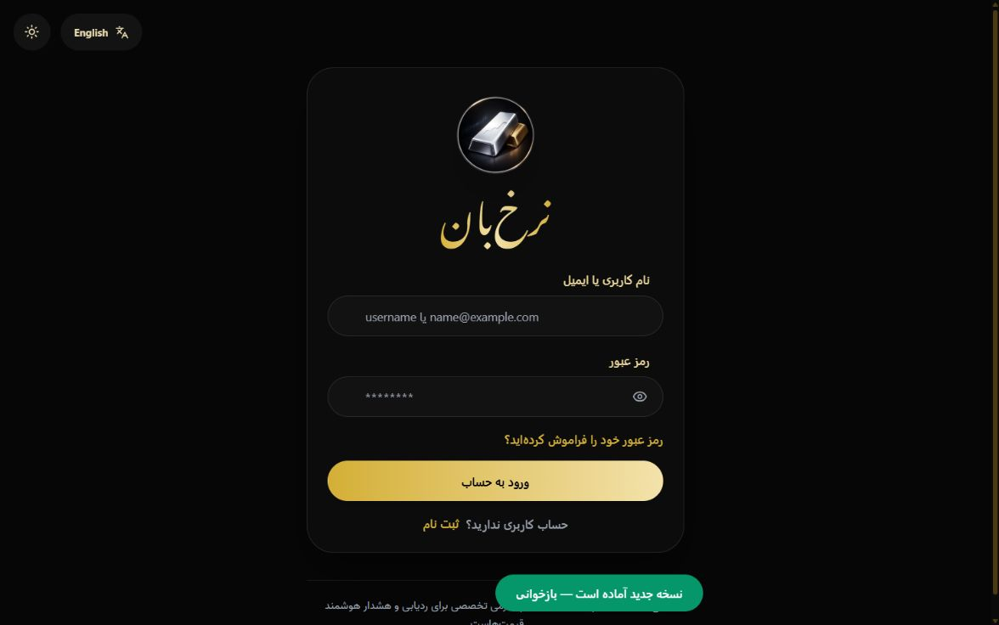
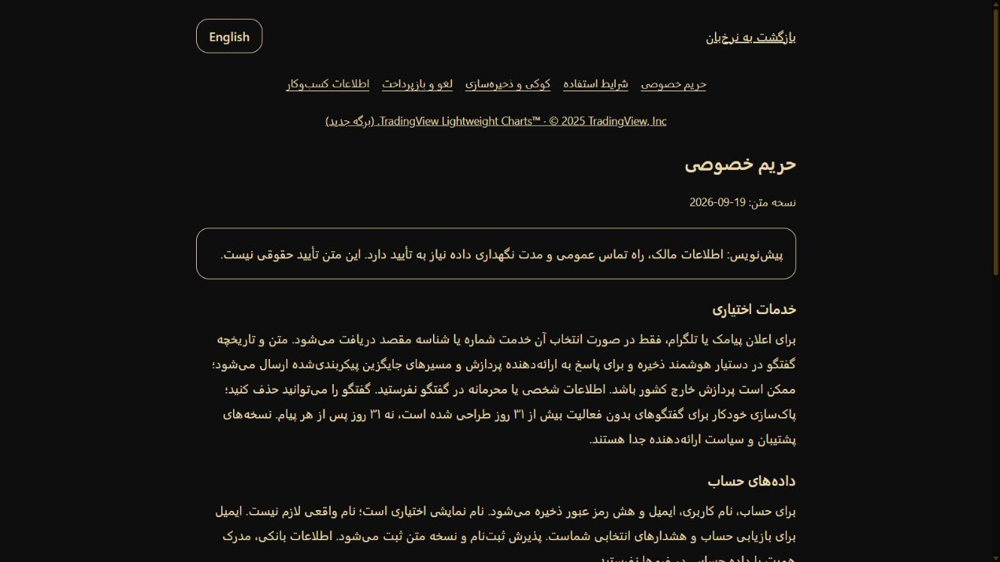
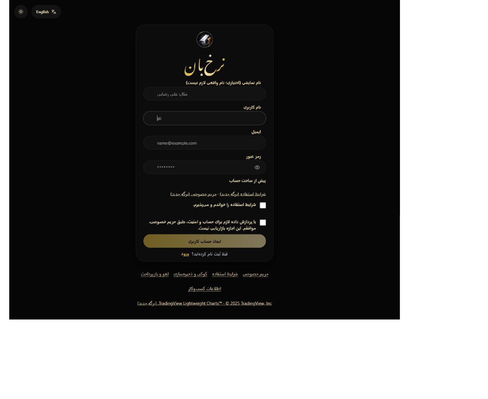
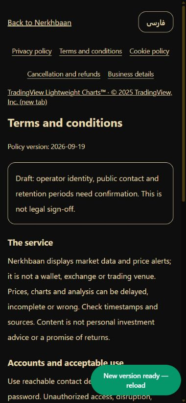

# Legal, privacy and accessibility readiness — 2026-09-19

Current release: 2.6.1. **Limited deployment completed. Not legal clearance.**

## Owner confirmation and publication decision — 2.6.1

The owner supplied and authorized publication of Ilia Shakeri / ایلیا شاکری,
Tehran, Iran, and iliashkr@gmail.com. There is no public postal address. The
current service is free and targets Iran; subscriptions and worldwide expansion
are future plans. No corporate registration, licence or address was invented.
All five pages expose an account-free email link. Policy receipts now use
`2026-09-19.1`; prior text remains in version control and prior receipts remain intact.
Persian refresh-cookie duration corrected to 30 days, matching English/server defaults.

The owner expressly authorized this limited release with backup and health checks,
acknowledging missing address, data-rights, retention and restore evidence. This
does not satisfy normal operator gates or authorize payment/global expansion.
The original 2.6.0 review below is historical; owner questions 1–2 are answered
except postal address and applicable registration/licensing evidence. Processor
register, retention/rights operations, asset/data rights, credential rotation,
restore drill and full accessibility proof remain open. No claims of full compliance.

Correction loop: initial scoped quality 8/10. Found stale missing-owner copy,
missing public email link and Persian cookie-duration mismatch; fixed these and
added regression checks. Final scoped implementation score: **9/10** after 207
backend passes (one skip), 34 frontend passes, three builds, live readiness and
public bilingual page checks. This score covers the requested owner-details
patch, not the entire infrastructure or legal readiness; those remain below 9
pending external proof. See the deployment record in `release-operations.md`.

## Scope and decision

Reviewed public web source, authentication, support, notifications, chat,
storage, external chart loading, image usage, public fonts and security headers.
Existing login flip stays unchanged. Production databases and volumes untouched.
This is risk reduction, not a promise against claims or litigation. An Iranian
lawyer should approve the actual operator, business model and final notices.
Owner country, target countries, public contact details and any off-site sales
remain unanswered. No invented business identity, refund deadline or licence.

## Delivered

- Public Persian/English `/privacy`, `/terms`, `/cookies`, `/refunds`, `/business`.
  Links on login, registration, recovery and application footer. Notices explicitly
  marked draft until missing operator/retention facts are settled.
- Separate unchecked terms acceptance and account-processing agreement;
  optional display name, no mandatory legal name. Backend rejects missing,
  false, string and numeric consent values and old policy versions.
- Support permission per submission; chat external-processing permission,
  stored before external calls. Receipts use existing security-event storage:
  user ID, event time, purpose and policy version, without duplicate message bodies.
  These records do not prove consent was legally informed without processor details.
- No inferred consent for existing accounts. No marketing checkbox or tracking
  permission bundled with account/support forms. Recovery requests have a purpose notice.
- TradingView remains blocked by default. Version 2.7.0 loads its chart script
  only after the visitor presses the dedicated load button; the choice lasts
  for that view and is not stored by Nerkhbaan.
  Advanced report links to the external chart; dashboard charts stay local.
  This also removes a script that the existing production CSP did not allow.
- Restored Lightweight Charts attribution and creator link; preserved the NOTICE.
- Preferences no longer written on initial render; chosen preferences tolerate
  blocked storage. Cookie policy explains session/local storage and PWA caches.
- Explicit reply labels, busy-button labels, keyboard focus outlines, readable
  placeholder colours, corrected password rules and retention wording.
- Old privacy promises about never sharing data, universal encryption and instant
  deletion removed. No testimonial/review section or fabricated customer counts
  found in the reviewed public web components; none invented or removed falsely.

## Applicable law — preliminary, not exhaustive

Iran is the working jurisdiction inferred from the product, domain and prior
deployment context; incorporation and target markets still need confirmation.

- [Iran Electronic Commerce Act, WIPO Lex](https://www.wipo.int/wipolex/en/legislation/details/7711):
  Articles 33–35 concern supplier disclosures and accessible, clear information;
  37–38 withdrawal and exceptions; 43 silence is not acceptance; 50–55 advertising;
  58–59 sensitive data, specified purposes, minimisation and data-subject requests;
  62 addresses rights in electronic content. Review implementing regulations,
  current amendments, financial-service exceptions, licences and taxes locally.
  Do not automatically apply a goods refund template to this information service.
- [GDPR, official EUR-Lex](https://eur-lex.europa.eu/eli/reg/2016/679): Article 3
  applicability needs establishment/targeting/monitoring facts, not just an
  accessible website. If applicable, map lawful bases, Article 13 disclosures,
  processor contracts, rights handling and international transfers. Do not treat
  mandatory service processing as freely withdrawable marketing consent.
- [ICO storage guidance, updated April 2026](https://ico.org.uk/for-organisations/direct-marketing-and-privacy-and-electronic-communications/guidance-on-the-use-of-storage-and-access-technologies/):
  necessary storage can qualify for an exception. Current UK rules also contain
  conditional appearance/statistical exceptions; not all analytics always require
  a banner. UK application and any exception must be assessed, not assumed from
  an old cookie checklist. No analytics exception is relied on here.
- [WCAG 2.2](https://www.w3.org/TR/WCAG22/): engineering target AA, not certification.
  Relevant checks: 1.1.1, 1.4.3, 1.4.11, 2.1.1, 2.4.7, 2.4.11, 2.5.8 and 3.3.2.

## Storage and data inventory

| Surface | Data / purpose | Current duration / gap |
| --- | --- | --- |
| Account | Username, email, password hash; optional display name | No comprehensive account deletion/retention workflow verified |
| Auth cookies | `nerkhbaan_session`, `nerkhbaan_refresh` | Defaults 15 min / 30 days; deployment settings must be checked |
| Admin cookie | `nerkhbaan_admin_session` | Default 30 min; actual deployment not checked in this task |
| Security events, sessions, reset/OTP records | Account security and permission receipts; hashed client identifiers | Expiry is not database deletion; approved purge schedule needed |
| Alerts, notification preferences | Thresholds, optional SMS/email/Telegram destination, webhook, push endpoint | Until operator retention/deletion workflow; disable does not imply erase |
| Support | Subject, message, account ID, timestamps, permission receipt | No verified purge schedule |
| Smart Assistant | Chat text/history sent to configured provider/fallbacks; stored sessions | Cleanup targets sessions inactive over 31 days; manual chat delete exists; backups/providers separate |
| Local storage | `language`, `theme`, `currencyMode`, dashboard order | Until site data cleared; written on user choice |
| Session storage | `splash-shown` | Tab session |
| Service worker | Public app assets | Replaced on update / clear site data; no API-response cache in reviewed worker |
| Infrastructure | Web requests and operational logs | Host log configuration/rotation and backup retention need operator verification |

No visitor analytics, ads or third-party embeds remain in the reviewed web
runtime. A blanket cookie banner is therefore not added. External links are
explicit actions with no referrer. Re-audit before adding pixels, embeds,
session replay or marketing; reject/withdraw must be as easy as accept.
No production network trace or full processor inventory was obtained in this task.

## Asset and claim inventory

| Asset | Evidence | Action / remaining risk |
| --- | --- | --- |
| Web and desktop brand PNG/ICO/PWA icons | Repository files; no ownership grant found | Owner must supply creation record/licence and trademark clearance; not declared copyright-free |
| Noto Nastaliq Urdu | Bundled `OFL.txt`, Noto Project Authors 2022 | Retain licence and verify provenance of shipped binary |
| Vazir WOFF/WOFF2 | Six files; no licence text beside binaries | Obtain exact upstream version and licence; filenames alone are not proof |
| Lucide icons | Installed ISC/Feather notice | Preserve notices in distribution; full dependency notice bundle still needs review |
| Lightweight Charts 5.2.0 | Apache licence and [versioned NOTICE](https://github.com/tradingview/lightweight-charts/blob/v5.2.0/NOTICE) | Added NOTICE, attribution logo and public creator link |
| Provider rates and articles | Public endpoints/source metadata | Public access is not commercial republication permission; written terms/permission still required |

Existing `` instances in the reviewed web runtime have alt text; brand
logos remain named and there are no stock/testimonial photos in that surface.
This is not a reverse-image ownership check or a complete dependency legal audit.

## Release blockers — owner action

1. Legal owner name, operating country, public complaint address, reachable
   privacy/support email, applicable registration/tax/licensing identifiers.
2. Actual target markets and whether any off-site payments, subscriptions or
   sales exist. Approve refund procedure before collecting payment.
3. Named hosting/email/SMS/push/chat processors, countries, contracts, retention,
   international transfer basis where applicable. Provider/fallback changes need review.
4. Approved retention matrix, tested access/export/correction/deletion workflow,
   backup expiry, legal holds and incident response. Do not erase production data
   to make the policy true. Document restore testing separately.
5. Brand/font/market-data/article rights evidence. Remove/replace unlicensed
   material if evidence cannot be supplied; do not assert ownership from possession.
6. Rotate credentials previously shared in chat; rotation not performed here.
7. Test whole site with keyboard, screen reader, zoom, mobile and both themes.
   Automated checks and a few screenshots cannot certify accessibility.

## Verification and correction loop

- Initial implementation score: 7/10. Found missing chat-processing disclosure,
  chart attribution, backend consent guards and misleading retention wording.
  Fixed these; added regression tests. Recovery copy no longer promises delivery.
- `npm.cmd run verify`: release alignment, Python static checks, API suite,
  frontend contracts, web/admin/desktop builds and browser-test discovery.
  Discovery is not a executed end-to-end test. PostgreSQL concurrency test remains
  skipped without `TEST_DATABASE_URL`.
- Backend: 208 tests, 207 passed, one skipped. Frontend: 33 contract tests passed.
- Final score must remain below legal launch readiness while owner facts,
  licensing and rights-operation proof are missing. Do not inflate to 9/10 to
  bypass missing external evidence. Technical changes and legal sign-off differ.
- Second-pass score: **8/10 for this readiness scope**, not 9/10. Completion
  is blocked on the seven operator/evidence items above, not more cosmetic work.

## Current browser evidence

1. Production login: legal links absent in the observed installed version.
   Capture `audits/privacy-2026-09-19/01-login-before.png`.
2. Local privacy: readable Persian sections and explicit draft status, public
   route, heading focus on navigation. Capture `02-privacy-after.png` in that folder.
3. Local signup: optional named display field, two unchecked agreements, links
   before submission, no horizontal overflow at observed desktop width. Tab
   moved display name → username → email → password → reveal control.
   Capture `03-signup-after.png`. No account or legal agreement submitted.
4. DOM inspection on local signup: zero iframe elements, zero off-origin script
   URLs, logo has alt text. This is not a complete network interception report.
5. Terms in English at 390px width: language/direction changed correctly, no
   horizontal overflow (document width 380px); capture `04-mobile-terms.png`.
   Cookie, refund and business links are separate public routes.

Browser inspection caught a focus-outline cascade conflict missed by source
tests; the global keyboard outline now takes precedence over utility resets.
After the new worker update, keyboard focus on the password field was measured
as a visible solid `rgb(232, 217, 174)` outline, using the rebuilt stylesheet.
Copy review also separated 30-day refresh cookies from the 31-day chat cleanup
threshold; a regression test now checks both against the server constants.
Screenshots were opened and reviewed. Authenticated support/chat submissions,
screen readers and production runtime after changes remain unverified.

### Captures

## Deployment handoff

Do not deploy draft terms as approved policy. After facts are supplied: replace
draft notices with truthful final bilingual copy; bump POLICY_VERSION if wording
changes materially; align server literal versions and tests; approve retention
and rights workflows; rerun checks; back up and use production deployment gates.
Deploy web/desktop-compatible API together. Old clients without the required
permission fields get 422 and must update; never backfill acceptance for them.
Rollback affects code, not the validity of existing receipts. Keep prior policy
text in version control. No database migration or destructive purge added.
